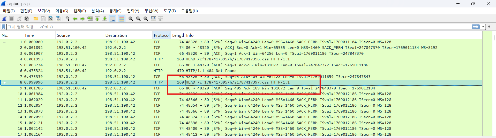
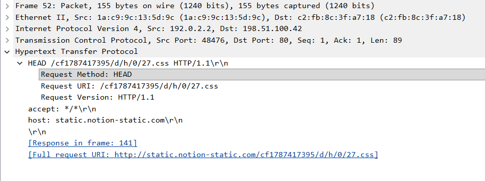

- solved by @cooku222


전체 트래픽은 `static.notion-static.com`으로 위장한 `198.51.100.42:80`과의 HTTP 통신이다. 

URL 규칙은 일관적으로 `/cf<세션>/d/<h|c>/<msg_idx>/<row><col>.css`의 형태를 띄고 있다. 이 규칙으로부터 대화 참여자와 대화 내역을 복원할 수 있다.



pcap에는 
```
HEAD /cf1787417395/d/h/0/06.css HTTP/1.1
HEAD /cf1787417395/d/h/0/04.css HTTP/1.1
HEAD /cf1787417395/d/h/0/12.css HTTP/1.1
...
```
위와 같은 요청만 나열식으로 있는데, 이 숫자를 행렬로 분해해준다. 
예를 들어, 12.css면 (1,2)로 분해한다. 한 자리수면 (0, n)으로 분해하면 된다. 

이 중 null 패딩 값도 있기 때문에 이를 필터링 해주면 대화 내용을 복원할 수 있다.

같은 row에 어떤 col들이 등장했는지 모아서 바이트로 조립하면 된다. 

예를 들어 d/h/0 그룹의 row=1에서 col {1,2,4,5,7}이 등장했다면 아래와 같이 복원할 수 있다.

col:  0 1 2 3 4 5 6 7   (0=최상위비트 MSB)
bit:  0 1 1 0 1 1 0 1  →  01101101 = 109 = 'm'
이진수에서 십진수로 변환 후, ascii로 해석한다. 

이런 식으로 row 0부터 순서대로 조립하면 사람이 읽을 수 있는 문자열이 나온다.
